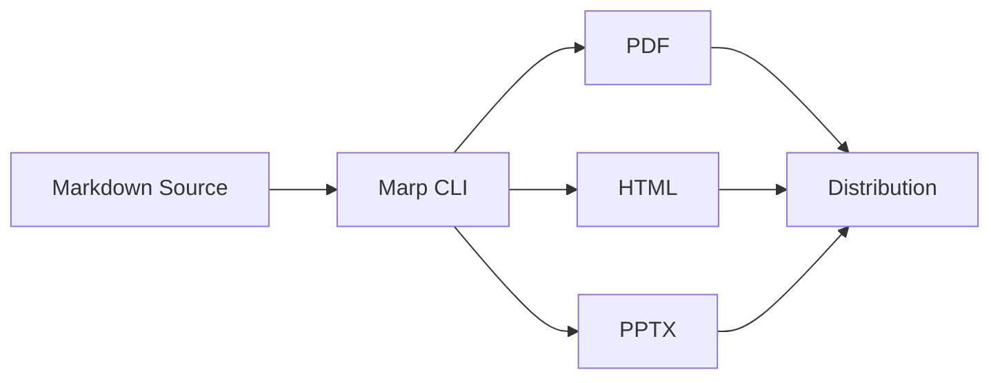

# Software Documentation System
## Version Control & Format Conversion

**Technical Documentation Team**
Contact: 24f2001048@ds.study.iitm.ac.in

---

## Overview

This presentation demonstrates:

- ✅ Custom theme specifications
- ✅ Page numbering and headers/footers
- ✅ Background images
- ✅ Mathematical equations
- ✅ Marp directives for styling
- ✅ Version control friendly format

---

<!-- _class: lead -->
<!-- _backgroundColor: #3498db -->
<!-- _color: white -->

# Why Marp?

Markdown-based presentations that are:
- **Version controllable**
- **Easy to maintain**
- **Convertible to PDF, HTML, PPTX**

---

## Algorithm Complexity Analysis

Understanding the performance characteristics of our search algorithm:

<div class="equation">

**Time Complexity:**
$$O(n \log n)$$

**Space Complexity:**
$$O(n)$$

</div>

Where $n$ represents the number of documents in the system.

---

## Big O Notation Examples

Common algorithmic complexities in our codebase:

| Algorithm | Complexity | Use Case |
|-----------|------------|----------|
| Binary Search | $O(\log n)$ | Document lookup |
| Quick Sort | $O(n \log n)$ | Result ranking |
| Hash Table | $O(1)$ | Cache access |

---

<!-- _backgroundImage: url('https://images.unsplash.com/photo-1451187580459-43490279c0fa?w=1200') -->
<!-- _color: white -->
<!-- _header: '' -->

<style scoped>
section {
  text-align: center;
  display: flex;
  flex-direction: column;
  justify-content: center;
}
h1, h2 {
  color: white;
  text-shadow: 2px 2px 4px rgba(0,0,0,0.8);
}
</style>

# Data Processing Pipeline

## Real-time Documentation Updates

---

## Mathematical Foundations

The documentation search relevance score is calculated using:

$$
\text{Relevance}(d, q) = \sum_{t \in q} \text{TF}(t, d) \times \text{IDF}(t)
$$

Where:
- $\text{TF}(t, d)$ = Term frequency of term $t$ in document $d$
- $\text{IDF}(t)$ = Inverse document frequency of term $t$

---

## Code Example

```python
def search_documents(query, documents):
    """
    Search documents using TF-IDF ranking
    Complexity: O(n * m) where n=docs, m=terms
    """
    results = []
    for doc in documents:
        score = calculate_relevance(query, doc)
        results.append((doc, score))
    
    return sorted(results, key=lambda x: x[1], 
                  reverse=True)
```

---

## Performance Metrics

> Our documentation system processes **1M+ queries per day** with an average response time of **50ms**

Key performance indicators:
- **Indexing Speed**: $O(n \log n)$
- **Query Time**: $O(\log n)$
- **Update Latency**: < 100ms

---

## Custom Styling with Directives

<!-- _class: lead -->
<!-- _backgroundColor: #2c3e50 -->
<!-- _color: #ecf0f1 -->

### Marp Directives Used:
- `<!-- _class: lead -->` - Centered content
- `<!-- _backgroundColor: color -->` - Custom backgrounds
- `<!-- _color: color -->` - Text color override
- `<style scoped>` - Slide-specific CSS

---

## Deployment Architecture



All formats generated from a single source!

---

## Matrix Operations

Documentation indexing uses sparse matrix multiplication:

$$
\mathbf{R} = \mathbf{D} \times \mathbf{Q}^T
$$

Where $\mathbf{D}$ is the document-term matrix and $\mathbf{Q}$ is the query vector.

**Complexity**: $O(k \cdot n)$ for $k$ non-zero entries

---

## Version Control Benefits

Benefits of using Markdown for presentations:

1. **Diff-friendly** - Track changes line by line
2. **Merge-capable** - Collaborate without conflicts  
3. **Reviewable** - Use pull requests for peer review
4. **Portable** - Plain text, works everywhere

---

<!-- _class: lead -->
<!-- _backgroundColor: #27ae60 -->
<!-- _color: white -->

# Thank You!

## Questions?

**Contact**: 24f2001048@ds.study.iitm.ac.in

---

## Additional Resources

For more information:

- **Marp Documentation**: https://marp.app/
- **GitHub Repository**: Store your `.md` files
- **CI/CD Integration**: Automated PDF generation
- **Theme Customization**: Full CSS support

**Email**: 24f2001048@ds.study.iitm.ac.in
